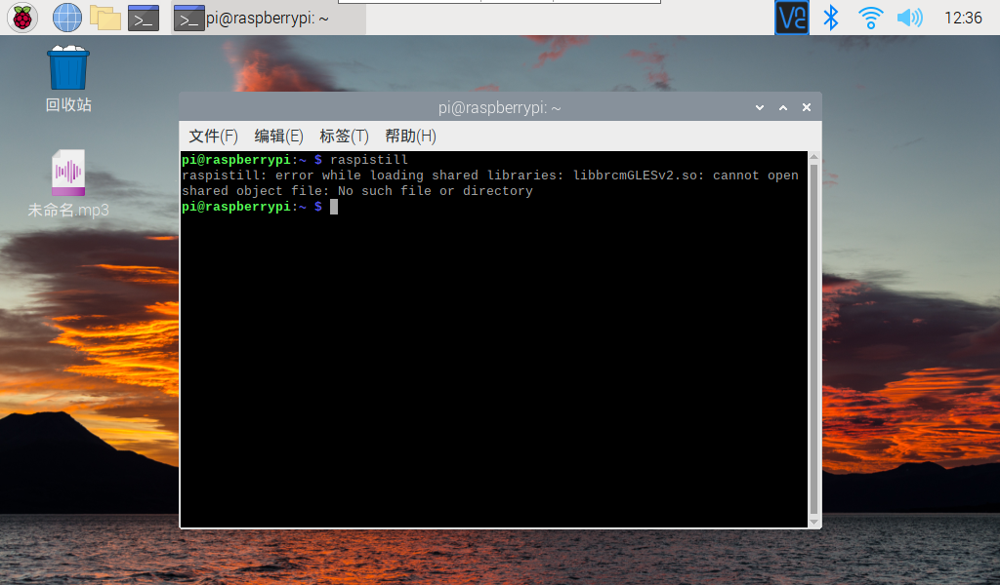
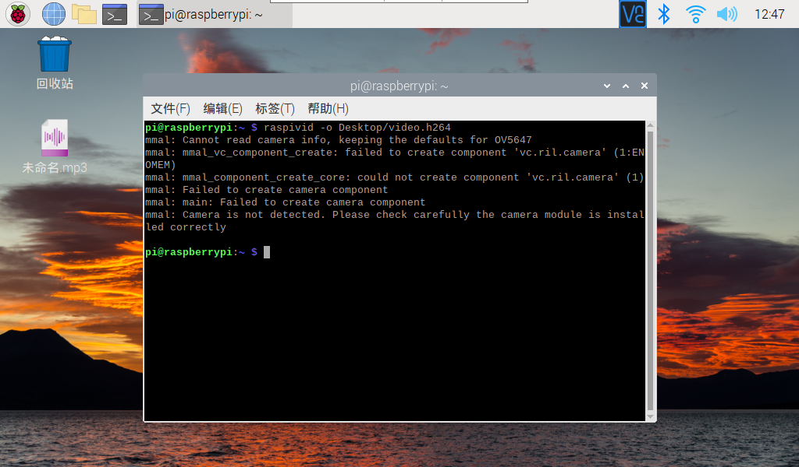
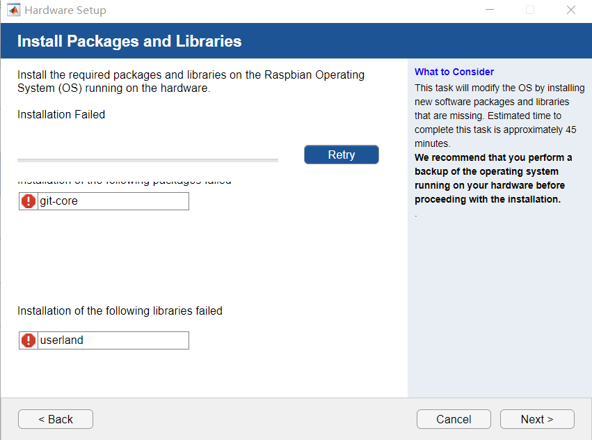

# ReadmeAboutNewRaspberry

## 包裹内容

- 树莓派

- 电源线一根（5V3A）

  （印象里是一定要3A的，不然可能不能正常工作）

- 16GB TF卡一张（已放入树莓派中）

- 读卡器一个

- 麦克风一个

- mini HDMI to HDMI 线一枚

## 树莓派系统

- Raspbian

- 用户名：pi

  密码：1234

- 已开启SSH，VNC，Camera

- 没有装 ARM Compute Library（MATLAB初始Hardware的时候给的一个可跳过的步骤）

## 一些相关操作

- 查看ip地址：

  ```bash
  ifconfig
  ```

- 与Windows文件传输

     - boot分区直接交互

     - STFP（需在Windows上下载[Filezilla](https://filezilla-project.org/)）

       ```text
       host：sftp://192.168.2.101 # IP名
       user：pi
       password：raspberry
       ```

- 远程连接

  - VNC连接（[下载地址](https://www.realvnc.com/en/connect/download/viewer/)）

    （树莓派里已经开启了SSH和VNC）

  - Windows系统中 win+r 输入mstsc 远程连接 

- 麦克风

  tb给的教程[链接](https://www.yahboom.com/study_module/rpimic)

  实测虽然`lsusb`没有查到目标的设备名，但是可以直接`audacity`进行录音..难道名称改了？

## 还有一些小小的问题..

- 这个附带购买的摄像头目前还用不好（有可能是软件的问题，也有可能硬件装的时候没装好也有可能%……&来不及debug了） raspistill（图片）和raspivid（视频）都不行（ 不知道你会不会用到

  

  

- MATLAB安装相关硬件的时候，有俩一直装不上[暴风哭泣]

  

